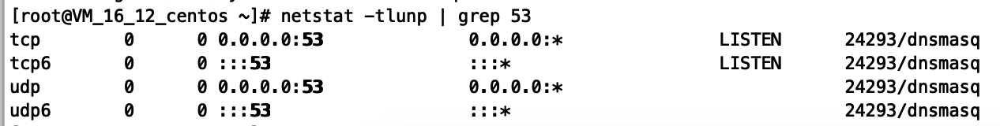
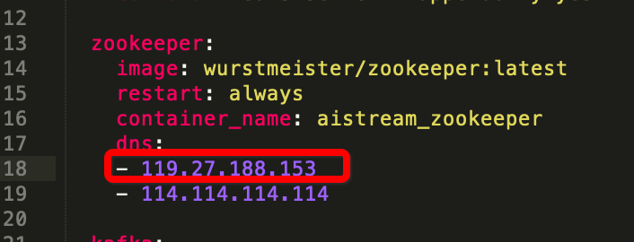
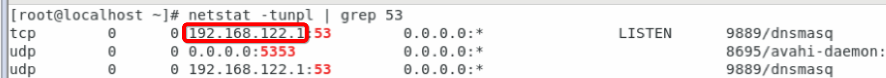
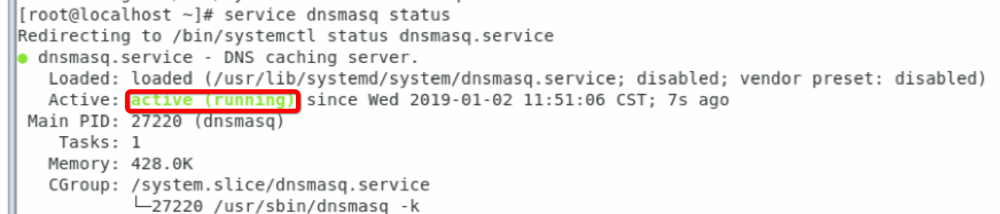
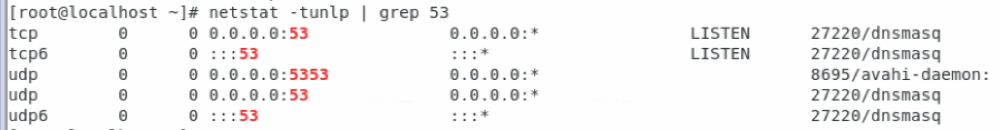
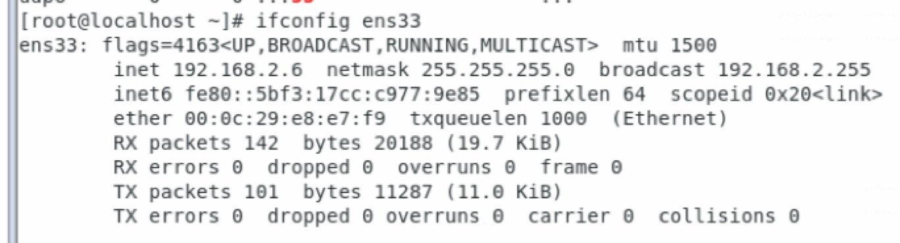
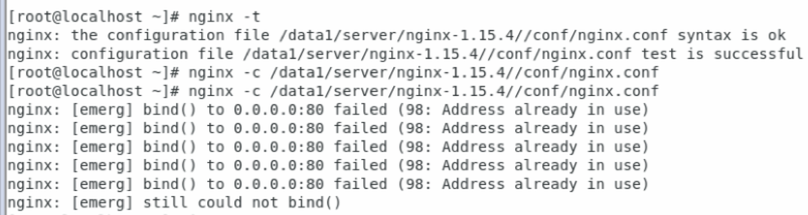

## Dnsmasq 部署 DNS 服务(CentOS)

[TOC]


### 软件部署

#### 安装dnsmasq

```shell
$ yum install dnsmasq
```

#### 检查端口占用

```shell
# 查看53端口是否被占用
$ netstat -tunlp | grep 53
```

#### 自定义配置dnsmasq配置

```shell
$ vi /etc/dnsmasq.d/address.conf

# 指定dnsmasq默认查询的上游服务器
server=114.114.114.114

# 把test.dns.com解析到特定的IP(下面是举例的测试域名和IP)
address=/test.commander.com/119.27.188.153
address=/test.qy.form.com/119.27.188.153
address=/test.wx.form.com/119.27.188.153
```

保存退出，确保本机53端口可对外访问

#### 启动dnsmasq

```shell
$ service dnsmasq start
```

#### 检查状态

```shell
$ netstat -tlunp | grep 53
```

​	如下图所示，开启成功。




#### 修改docker-compose文件

​	在docker-compose文件中找到所有设置dns的services，添加dns服务器的IP（119.27.188.153为举例dns服务器IP），***自定义的dns域名服务要放在第一位，否则可能无法解析***，没有设置dns的services不用管。docker-compose文件有2个，在aistreamserver和formserver目录下。




#### 重新生成docker容器服务

```shell
# 进入对应的docker-compose目录下，执行下面命令(aistreamserver和formserver目录都要执行)
$ sudo docker-compose up -d
```


### Centos开放端口

开放dns服务器访问端口（53）、网站服务端口（80、443）、grpc服务端口（12345）

```shell
firewall-cmd --zone=public --add-port=53/tcp --permanent
firewall-cmd --zone=public --add-port=53/udp --permanent
firewall-cmd --zone=public --add-port=80/tcp --permanent
firewall-cmd --zone=public --add-port=80/udp --permanent
firewall-cmd --zone=public --add-port=443/tcp --permanent
firewall-cmd --zone=public --add-port=443/udp --permanent
firewall-cmd --zone=public --add-port=12345/tcp --permanent
firewall-cmd --zone=public --add-port=12345/udp --permanent
firewall-cmd --reload
```

```
kill -9 30030
service dnsmasq start
service dnsmasq status


```

#### 重启后操作

##### 检查dns服务器

```shell
# 检查53端口情况
netstat -tunlp | grep 53
```

如图，表示被占用端口：



```shell
# 杀掉进程
kill -9 9889

# 开启dns服务
service dnsmasq start
# 查看服务状态，（如下图表示成功）
service dnsmasq status
```



```shell
# 查看端口情况
netstat -tunlp | grep 53
```

如图表示成功：




##### 检查IP是否改变

```shell
# 检查本机网卡
ifconfig ens33
```



ip改变则修改相应的文件，/etc/dnsmasq.d/address.conf，/etc/resolv.conf，/data1/aistreamserver/docker-compose.yml，/data1/formserver/docker-compose.yml，修改相应的ip

修改成功后，

```shell
# 重启dns服务
service dnsmasq restart

# 进入/data1/aistreamserver
docker-compose up -d

# 进入/data1/formserver
docker-compose up -d
```


#### 启动nginx服务

```shell
# 检查配置文件，找到配置文件路径
nginx -t 
```


```shell
# 执行配置文件
nginx -c /data1/server/nginx-1.15.4//conf/nginx.conf
```

如出现如图所示情况，先杀掉nginx进程



```shell
# 重新加载配置文件
nginx -s reload
```

